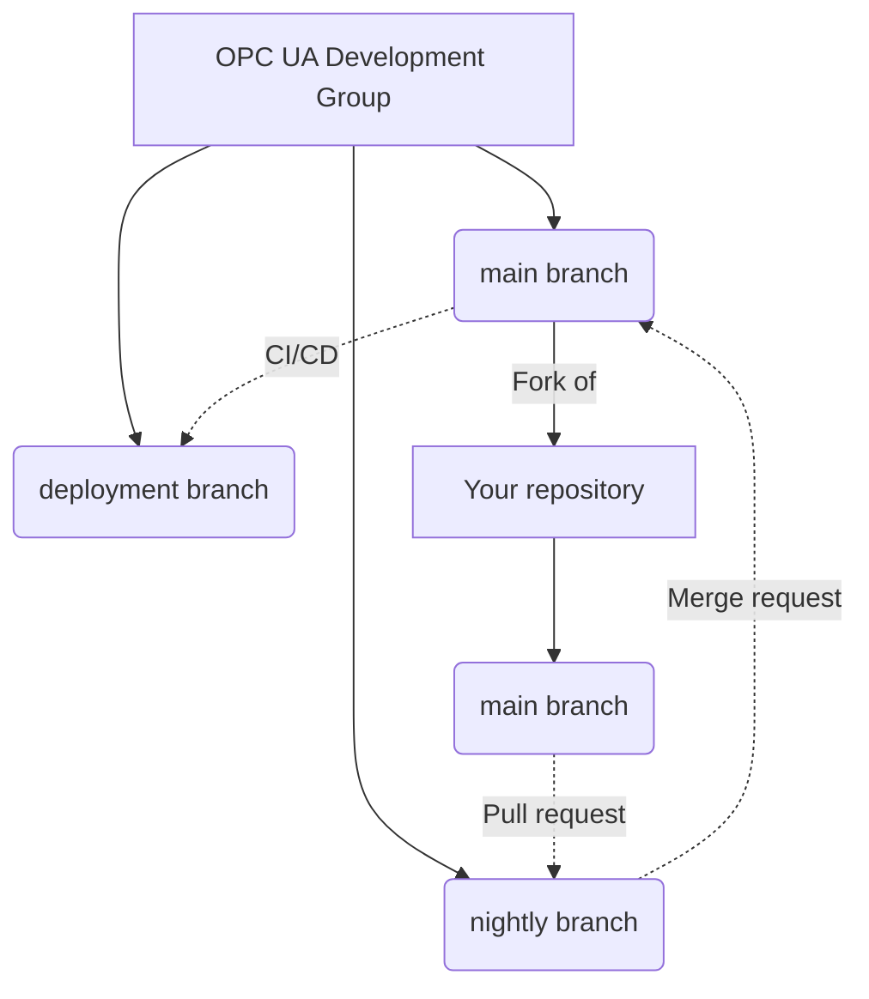

# Contributing
## Quick intro
If you desire to make any changes within this project, please create a fork of this repository and fork of each submodule part you want to contribute to. When you are ready to have your changes included in the main project, please make a Pull request with provided Template in the Gitlab Pull-request section. The following diagram, depicts the prefered repository structure: 

## Recomended Project repositories structure 

## Contribution rules
1. The master branch of this project holds the latest stable changes, Pull-requests for this branch will be Rejected.
1. Changes are commited to a niglty branch throught Pull-requests. 
1. Each accepted Pull-Request goes throuth projects CI/CD pipeline, and if passed, a Merge-request is allowed. 
1. A Merge-request must be aporved by one of the Project maintainers, preferabbly, not the one who initiated the Merge-request. 
